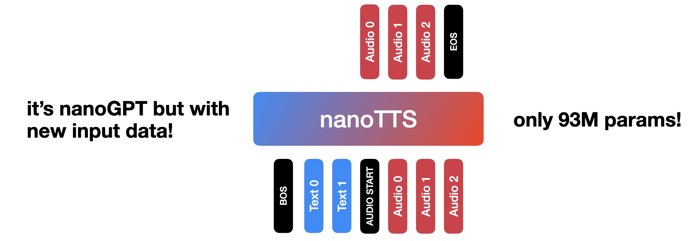

# nanoTTS

**goal**: a minimal, simple, hackable text-to-speech (TTS) system using a GPT-2-style transformer decoder.



**demo**: [here's a sample](https://x.com/psandovalsegura/status/2040905729545220167?s=20) generated after ~9 epochs over 53.78 hours of English text + audio pairs.

**key design decisions**:
1. look like an LLM: tokens in, tokens out. no extra modules, no added complexity.
2. keep architecture as simple as possible. follow [nanoGPT](https://github.com/karpathy/nanoGPT).
3. audio tokens from [WavTokenizer](https://github.com/jishengpeng/WavTokenizer?tab=readme-ov-file): a SOTA approach for converting audio to a short sequence of discrete tokens
4. closed-set voices: simplifies input sequence. we only mimic 247 speaker ids from the "train-clean-100" split of LibriTTS.

## install

1. install [WavTokenizer](https://github.com/jishengpeng/WavTokenizer?tab=readme-ov-file). you will need to add a *pyproject.toml* file to your clone of that repo so that you can install `packages = ["encoder", "decoder"]`.
2. additional packages in requirements.txt.

## table of contents

| file | purpose |
| --- | --- |
| `train.py` | main training script; loads LibriTTS, builds the model/tokenizers, and runs training or resume-from-checkpoint |
| `model.py` | GPT-style decoder-only transformer used for next-token prediction over the joint text/audio sequence |
| `libritts_dataset.py` | dataset wrapper that converts raw LibriTTS examples into `[BOS, text tokens, SPK_ID, AUDIO_START, audio tokens, EOS]` training sequences |
| `tokenizer.py` | joint tokenizer interface that combines the text tokenizer with WavTokenizer audio codes and handles decode for inference |
| `configurator.py` | lightweight config override helper used by `train.py` for command-line and file-based hyperparameter overrides |
| `text_tokenizer/libritts_tokenizer.py` | script that trains the BPE text tokenizer and appends speaker-id special tokens |
| `text_tokenizer/libritts_bpe.json` | serialized BPE tokenizer used for transcript text plus special tokens |
| `text_tokenizer/libritts_tokenizer_data.pkl` | cached transcripts and speaker IDs used to build the text tokenizer |

## other
- to retrain BPE text tokenizer: in *text_tokenizer/* run `python libritts_tokenizer.py` which will use transcripts and ids from *libritts_tokenizer_data.pkl* and save *libritts_bpe.json*.

## cite

```bibtex
@misc{sandovalsegura2026nanotts,
  title={nanoTTS: Minimal Text-to-Speech using nanoGPT},
  author={Pedro Sandoval-Segura},
  year={2026},
  note={GitHub repository}
}
```
