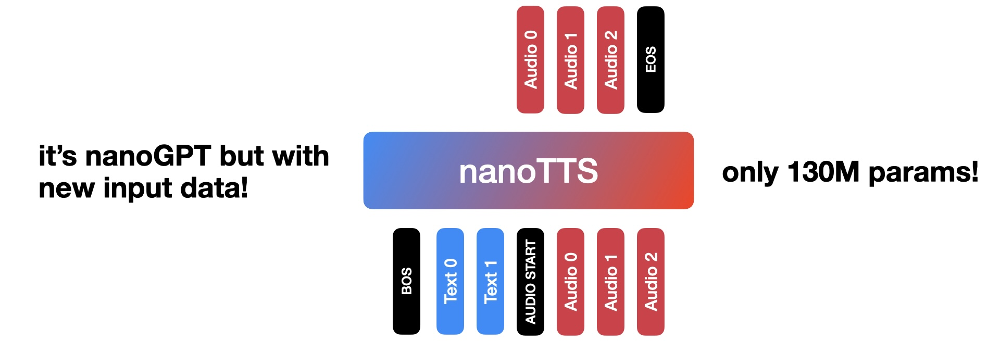

# nanoTTS

<p align="center">
  <a href="https://huggingface.co/spaces/psando/nanoTTS"></a>
</p>

**goal**: a minimal, simple, hackable text-to-speech (TTS) system using a GPT-2-style transformer decoder.



**demo**: [here's a sample](https://x.com/psandovalsegura/status/2040905729545220167?s=20) generated after ~32 epochs over 53.78 hours of English text + audio pairs.

**key design decisions**:
1. look like an LLM: tokens in, tokens out. no extra modules, no added complexity.
2. keep architecture as simple as possible. follow [nanoGPT](https://github.com/karpathy/nanoGPT).
3. audio tokens from [WavTokenizer](https://github.com/jishengpeng/WavTokenizer?tab=readme-ov-file): a SOTA approach for converting audio to a short sequence of discrete tokens

## install

1. `pip install requirements.txt`
2. `bash setup_wavtokenizer.sh` to install [WavTokenizer](https://github.com/jishengpeng/WavTokenizer?tab=readme-ov-file).

## table of contents

| file | purpose |
| --- | --- |
| `train.py` | main training script; loads LibriTTS, builds the model/tokenizers, and runs training or resume-from-checkpoint |
| `model.py` | GPT-style decoder-only transformer used for next-token prediction over the joint text/audio sequence |
| `libritts_dataset.py` | dataset wrapper that converts raw LibriTTS examples into `[BOS, text tokens, AUDIO_START, audio tokens, EOS]` training sequences |
| `tokenizer.py` | joint tokenizer interface that combines the text tokenizer with WavTokenizer audio codes and handles decode for inference |
| `configurator.py` | lightweight config override helper used by `train.py` for command-line and file-based hyperparameter overrides |

## other
- to retrain BPE text tokenizer: in *text_tokenizer/* run `python libritts_tokenizer.py` which will use transcripts from *train-clean-100.json* and save *libritts_bpe.json*.

## cite

```bibtex
@misc{sandovalsegura2026nanotts,
  title={nanoTTS: Minimal Text-to-Speech using nanoGPT},
  author={Pedro Sandoval-Segura},
  year={2026},
  note={GitHub repository}
}
```
